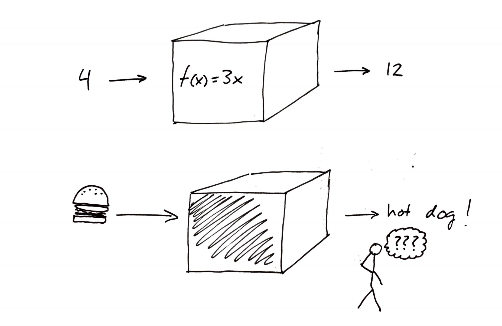

# Énoncé du sujet

## Intro JSanf

L'intelligence artificielle est un sujet d'actualité de haute importance avec les
nombreuses avancées
technologiques qui se font depuis les dernières années avec des avancés comme la
conduite automatique
par la compagnie Tesla ainsi que le Neuralink. L'intelligence artificielle ou
l'IA nous entourent
dans notre vie que se soit sur notre cellulaire, sur notre ordinateur et même nos automobile.
Quel est le fonctionnent de ce processus et comment peut-il être utilisé afin de
bénéficier l’être humain?. Pour tenter de répondre à cet question, nous allons
écrire un programme qui permet de faire de l' Optical Character Recognition ou OCR
qui consiste à lire un chiffre écrit à la main et retourner une réponse grâce à
un entraînement sur l'ordinateur nommé Supervised Learning. Pour en découvrir
plus sur ce processus, nous allons aussi voir l'impact d'un entraînement varié
sur le modèle en changeant l'écriture de l'humain pour voir si cela constitue un
biais.

## Mise en contexte

L'intelligence artificielle est au coeur de l'actualité depuis près d'une
décénie. Elle est dejà entrain de changer le monde , et ce, dans plusieurs 
secteurs incluant la finance, la sécurité, la santé, la justice criminel, 
les moyens de transports, la publicité, et plusieurs autres. 

Que ça soit des décisions sur l'investissement d'un portefeuille
d'un individu ou de la détection de fraude en identifiant des anormalités, l'intelligence
artificielle est de plus en plus présente dans le secteur de la finance. {cite}`nytimes` 

Du côté de la 
sécurité, un excellent exemple serait [Project Maven](https://en.wikipedia.org/wiki/Project_Maven)
un projet d' intelligence artificielle du [Pentagon](https://en.wikipedia.org/wiki/The_Pentagon) 
des États-Unis qui est capable de passer à travers plusieurs informations, 
vidéos et photos pour détecter des dangers potentiels.

L'intelligence artificielle est très importante dans la santé avec des compagnies comme 
[Merantix](https://www.merantix.com/), une compagnie Allemande qui on permis de detecté 
des ganglions lymphatiques ainsi que des problèmes liés à ceux-ci tel que des lésions 
ou des cancers. L'étude de séquence d'ADN par l'intelligence artificielle permet de détecter
des maladies génétiques et des cancers.

Un des domaine le plus importants en ce moment serait, les moyens de transport avec plus de $80
milliard investi dans des véhicule de conduite autonome entre 2014 et 2017. L'intelligence 
artficielle dans ce domaine aurait pour but de diminuer grandement l'erreur humaine dans les transports
et réduire à presque zéro les accidents si la majorité des autos était intelligente. De plus, cela réduirait
aussi grandement le traffic grâce à la communication entre les automobiles intelligents. La compagnie [Tesla](https://www.tesla.com/)
en est déjà très avancée pour ce qui est de leur auto intelligente.{cite}`gouvqc`

Comme on peut le voir, cette technologie a permis de multiples avancées dans des domaines où 
il se fait extrêmement difficile de modéliser la problématique selon une
fonction mathématique particulière. L'analyse de language en est un bon exemple.
Le travail ne peut être modélisé par une seule fonction mathématique puisque
les conditions souvent changeantes nécessiteraient une multitude de fonctions
différentes pour chaque environnement qui n'est pas réaliste. La solution est
plutôt « d'entraîner » un ordinateur à comprendre le monde qui l'entoure.
Pour continuer avec l'exemple de l'analyse du language, une solution serait
de fournir à l'ordinateur une immense quantité d'exemples et de solutions afin
qu'il développe la capacité de prédire la solution à de nouveaux exemples.
[GPT-3](https://github.com/openai/gpt-3), 
un nouveau modèle d'intelligence artificielle produit par 
[OpenAI](https://openai.com), a permis à des développeurs de créer un programme
lui même capable de programmer à partir de demandes spécifiques faites par un
utilisateur.

Malgré les avancées incroyables que l'intelligence artificielle a déjà permis et
continuera de permettre dans le futur, elle n'est pas sans ses inconvénients. Au
courant des dernières années, les systèmes intelligents sont de plus en plus
reconnus coupables de discrimination envers certains groupes d'individus. Une
étude réalisée par le [NIST](https://www.nist.gov/) à étudié le taux d'erreur de
différents programmes de reconnaissance faciale en fonction des différences de
sexe et d'ethnicité des individus sur les photos analysées. L'étude 
présente des taux d'erreur
jusqu'à cent fois plus élevés pour des personnes d'origine asiatique ou 
africaine lorsque comparé à des personnes d'origine européenne {cite}`nistbias`.
Le taux d'erreur est aussi plus élevé chez les femmes que chez les hommes, et
ce, peut importe l'origine.

Un autre résultat important de cette étude est que le taux d'erreur associé à la
reconnaissance de personnes asiatiques n'est pas présent dans des programmes
réalisé dans des pays d'Asie. Cette observation permet de déduire l'un des plus
grands problèmes liés à l'intelligence artificielle: le biais.

Contrairement à une fonction mathématique qui transforme un chiffre de manière
définie, les procédés menant à la reconnaissance faciale sont beaucoup plus
flous et souvent très mal compris. Plusieurs considèrent les programmes
entraînés comme des «boites noires». Il est difficile de prédire ce qui sortira
de la boîte lorsque l'on y insère quelque chose, et il est encore plus difficile
de comprendre pourquoi le programme prend certaines décisions plus que d'autres.

