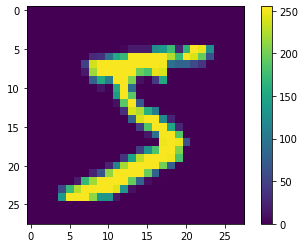

# Les librairies nécessaires
Afin de réaliser ce projet dans des temps raisonnables, nous utilisons des
outils et des données réalisés par des organisations réputées comme Google,
[Numpy](https://numpy.org/) et la [Matplotlib](https://matplotlib.org/) development team.

## Tensorflow
[Tensorflow](tensorflow.org) est une plateforme nous permettant d'accélérer
le développement de notre application d'apprentissage machine. La librairie
procure un [API](https://en.wikipedia.org/wiki/API) en Python donnant accès
à de multiples fonctions utilisées pour obtenir des données et les utiliser
pour entraîner notre programme.

### Historique
Développée par Google et rendue publique en 2015 {cite}`wikitf`, la librairie
a depuis permis aux masses de développer toutes sortes d'applications
bénéficiant de l'intelligence artificielle. TensorFlow est une version polie
du système DistBelief. DistBelief est un produit du projet The Google Brain.
Après avoir été utilisé pendant quelques années pour des produits Google ainsi
que pour de la recherche, DistBelief est amélioré et rendu publique sous le
nom TensorFlow {cite}`tfpaper`. Aujourd'hui, la
[page Github](https://github.com/tensorflow/tensorflow) de TensorFlow mentionne
plus de 100 000 utilisateurs et 2 780 contributeurs. La librairie est utilisée
par de multiples entreprises dont Google, Coca-Cola, airbnb, Twitter et Intel
{cite}`tfmain`.

### Notre utilisation
Nous utilisons TensorFlow afin de faciliter l'accès à nos données et afin
de créer notre modèle.

#### Accès aux données
Pour entrainer notre modèle, nous utilisons la base de données
[MNIST](http://yann.lecun.com/exdb/mnist/). Bien qu'elle soit très complète,
le format de cette base de donnée est assez complexe
([Voir la section sur le *preprocessing*)](./preprocessing.ipynb). Heureusement,
la libraire TensorFlow procure un
[interface simple](https://www.tensorflow.org/api_docs/python/tf/keras/datasets/mnist/load_data)
avec le langage de programmation que nous utilisons.

```python
((train_data, train_labels), (test_data, test_labels)) = mnist.load_data()
num_data = np.vstack([train_data, test_data])
num_labels = np.hstack([train_labels, test_labels])
```

La classe `mnist` fournie par la librairie `Tensorflow`nous permet de charger en mémoire toutes les données nécessaires en seulement trois lignes.

#### Entraînement du modèle
Le domaine de l’IA s’avère assez complexe. Programmer et entraîner un modèle nécessite des connaissances en mathématiques avancées {cite}`Goodfellow-et-al-2016`.

`Tensorflow`vise à accélérer le développement de l’intelligence artificielle ainsi que de rendre ce développement accessible aux masses. Afin de simplifier la réalisation de notre programme et afin de le rendre plus efficace, nous comptons donc utiliser les méthodes d’entraînement fournies par la librairie. Pour aider le lecteur à comprendre le fonctionnement du programme (et donc pour éviter le phénomène de la [boîte noire](lien vers la section de la boîte noire), chaque fonction utilisée sera décortiquée et expliquée en détails.
```python
model = keras.Sequential([
    keras.layers.Flatten(input_shape=(28, 28)),
    keras.layers.Dense(128, activation='relu'),
    keras.layers.Dense(10)
])

model.compile(optimizer='adam',
	loss=tf.keras.losses.SparseCategoricalCrossentropy(from_logits=True),
              metrics=['accuracy'])
model.fit(train_images, train_labels, epochs=10)
```
Seulement quelques lignes sont nécessaires à l’entraînement de notre modèle.

## Numpy
[NumPy](https://numpy.org) est une librairie facilitant le calcul avec le langage de programmation que nous utilisons pour créer notre modèle.

### Historique
La libraire à été créée en 2005 et était à l’époque basée sur les librairies [numériques et les modules mathématiques](https://docs.python.org/3/library/numeric.html) de Python {cite}`numpy`.
Numpy vise à rendre la réalisation de grands calculs numériques plus simples et optimisée. Plusieurs de ses capacités ont des fonctions homologue dans les logiciels [Matlab](https://www.mathworks.com) et [Maple](https://maplesoft.com).

### Notre utilisation
Comme sera possible de l’observer tout au long de ce rapport, les mathématiques constituent le pilier principal sur lequel repose le domaine de l’intelligence artificielle. De plus, la plupart des composantes des réseaux neuronaux peuvent être représentés comme des matrices. Numpy permet d’utiliser certaines propriétés des matrices afin de paralléliser les calculs menant à l’entraînement du modèle.  De plus,  comme nous le verrons dans la section suivante, Numpy peut être utilisé afin de représenter des images comme des matrices, et donc faciliter les opérations sur chacun des pixels.

## Matplolib
[Matplotlib](https://matplotlib.org) est une librairie de visualisation implémentée dans le langage de programmation Python.

### Historique

La libraire est un projet à code source ouvert financé par [Numfocus](https://numfocus.org). Déployé depuis plus de 17 ans cite`wikimatplotlib`,  la librairie permet, tout comme `Numpy`, au langage de programmation Python de se rapprocher de l’application Matlab, tout en restant libre de droit.

### Notre utilisation

La librairie fourni un *API* simple à utiliser permettant de réaliser des graphiques directement dans nos notebooks. Nous utilisons aussi la fonctionnalité permettant de représenter des images comme suit:

```python
plt.imshow(train_data[0])
```

Ce qui permet d’obtenir la figure suivante:



`train_data[0]` est un `array` de pixels, représentés par leur `grayscale value`. Nous discuterons plus de ces termes dans la section suivante. 